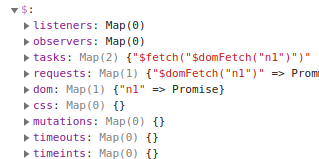

# jFactory
jFactory is an Open Source JavaScript library that allows you to easily compartmentalize your application into components. Thus, everything they initialize can be  tracked, stopped and removed automatically.

**Simply call `myComponent.$uninstall()` to automatically interrupt and uninstall the DOM, CSS, views, promises, requests, timers, observers and event listeners. Later, call $install() to reload your component.**

* [Installation](ref-import.md)
* [Documentation](ref-index.md) / [Traits](ref-index.md#traits-component-features) / [Classes](ref-index.md#classes-internal-library)
* [Playground](playground/README.md) /  [Starter Kit](https://github.com/jfactory-es/jfactory-starterkit)

## Abstract

jFactory components are able to:

- operate like a service (install, enable, disable, uninstall) 
- automatically switch off subscribed dom, css, views, promise, requests, timers, observers and event listeners. 
- automatically prevent all expired asynchronous calls (promise subtrees, event handlers...) 
- automatically ensure that all the promise chains are completed at service state change
- keep track in DevTools of all running subscriptions (listeners, timers, requests, promises, dom, css...)
- improve the Promise chains (Awaitable, Completable, Cancelable and Expirable)
- easily create/load CSS & DOM and clone from \<template> 

## Supported APIs
 

 

jFactory also supports **Vue.js**, **React**, and **HTML5 WebComponents** allowing components to automatically **uninstall** and **reinstall** their views.
See [Playground](playground/README.md).

## Overview

In a nutshell, jFactory provides methods to register listeners, views, dom, css, requests and asynchronous tasks that will be automatically stopped (including subpromise trees) and removed at opposite service state change (install/uninstall, enable/disable). 

Components **[can be created from any Class](ref-components.md)**, 
or by using a simple Object Literal through the shortcut [`jFactory()`](ref-components.md#create-a-component-literal):  

```javascript
let component = jFactory("myComponent", {
  onInstall() {
    this.$domFetch("#myDiv", "asset.html", "#parent").then(() => this.$log("html loaded"));
  },

  onEnable() {
    this.$interval("myUpdater", 250, () =>
      this.$fetchJSON("myRequest", "asset.json").then(() => this.$log("updated"))
    )
  }

  // ... your own methods and properties
})

await component.$install(); 
await component.$enable();
await component.$disable(); 
await component.$uninstall();  
```
[Playground](playground/README.md) / [Starter Kit](https://github.com/jfactory-es/jfactory-starterkit)

## Is that complicated?

jFactory is an easy-to-learn library based on jQuery. Unlike a framework, it does not impose an application architecture: you are free to use only what you want without restriction. 

All the [methods are listed here](ref-index.md#traits-component-features).

## Patterns

- Registry: all component subscriptions (listeners, promises, timers, fetch, dom...) are explorable in a registry, allowing quick visual inspections in DevTools.

- [Tasks](TraitTask.md): asynchronous processes can be registered as expirable tasks that block the current Service State Change, guaranteeing that everything is resolved before completing it, including all subpromises. 

- [Remove Phase](TraitService-Phases.md#remove-phase): jFactory will automatically stop and remove the subscriptions (listeners, promises, timers, fetch, dom...) registered during an opposite state change (install/uninstall, enable/disable)

- [Promise Chains](JFactoryPromise.md): jFactory uses extended native Promises that makes the whole Chain[ Awaitable](JFactoryPromise.md#chain-awaitable), [Completable](JFactoryPromise.md#chain-completion--cancellation), [Cancelable](JFactoryPromise.md#chain-completion--cancellation) and [Expirable](JFactoryPromise.md#chain-expiration).

- [Traits](ref-components.md#create-a-component-base-class): Components are Objects created from Classes dynamically extended by JFactoryTraits. 

- Debug: jFactory is designed for asynchronous component-based application development, using contextual loggers and subloggers,
 filterable source-mapped stack traces, identifiers, loggable extended errors, explorable promise chains, ...
     
## Library   

jFactory is designed from [ES6 Classes](ref-index.md#classes-internal-library):

- [Extended Promise](JFactoryPromise.md)
    - Expirable, awaitable, explorable Promise Chain
    - Status properties 
- Composite Functions
    - Wrappable / Conditional / Expirable Functions
- Awaitable asynchronous observers
- Traits, for dynamic mixins with configurable parser
- Loggers, with identified and formatted console logs and inherited switches 
- Errors, with explorable data
- Stack traces, filterable and source mapped   

## Philosophy

- Does not modify JavaScript prototypes
- Injected methods and properties are prefixed to avoid conflicts 
- Most names are prefixed by affiliation for easier code completion
- All registrations must be named, to reinforce debugging 
- Most of the library is overridable (no inaccessible private function)
- Designed for debugging and inspections

###### Modular JavaScript
  
- Written in ES6+ Modules with Class optimized for Tree Shaking
- Highly configurable, overridable and dynamically patchable
- Interoperable. Framework-agnostic. No transpiler.  
- Provides a "Developer Build" for additional validations and debugging properties   

## Implementation
[](https://github.com/jfactory-es/jfactory)
[](https://www.npmjs.com/package/jfactory)
[](#implementation)
<!--
[](#implementation)
[](#implementation) 
-->

- Supports Vue.js, React and HTML5 Web Components
- Supports Promises, Listeners, Timers, Mutations, DOM, CSS   
- Dependencies: jQuery, Lodash

## How to Contribute

jFactory is an Open Source project. Your comments, bug reports and code proposals are always welcome. This project is new and you can help a lot by spreading the word. Also consider adding a github star, as it seems very important for its visibility at this stage. Thank you for your contributions! 
